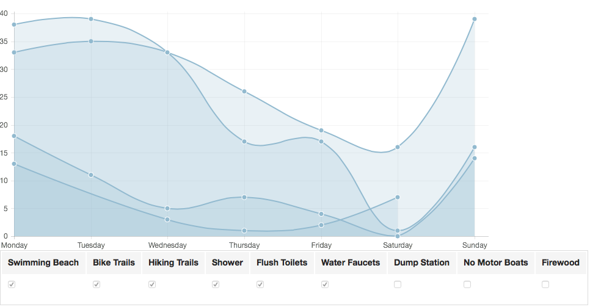

# Campground Availability Data Analyzer

We're planning a camping trip to the Northern Highland American Legion State Forest in Wisconsin.  There are a large number of campgrounds to choose from, and many of them are frequently full.  Fortunately, the Wisconsin DNR provides a website shows how many campsites are available at each campground.  Unfortunately, this data is always "point in time", so it is not easy to see trends.  

I wanted to see which campgrounds were least likely to be full on the day of our arrival, so I set up a process to archive the DNR's web page daily, and small application to parse the data and show trends for each day of the week.



I set up a cron job on a Raspberry PI to execute the following command on a daily basis:

```
curl "http://dnr.wi.gov/topic/StateForests/nhal/Campgrounds.asp" > `date "+%Y-%m-%d"`.html
```

There is always a risk that I miss a day of data due to problems with the DNR's website or network connectivity failures.  But I decided to live with the risk rather than invest a bunch of time making the data capture more robust.

In addition to the chart showing availability for each campground, there is also a table showing the average daily availability for each of the campgrounds.
